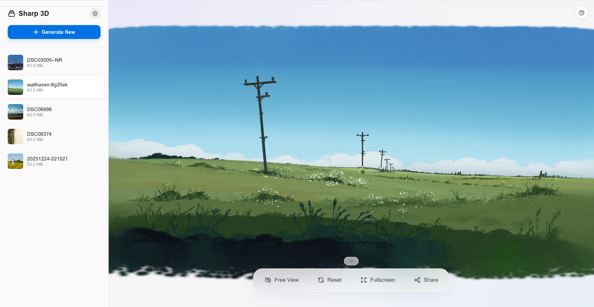
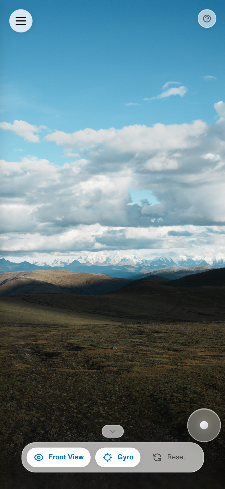
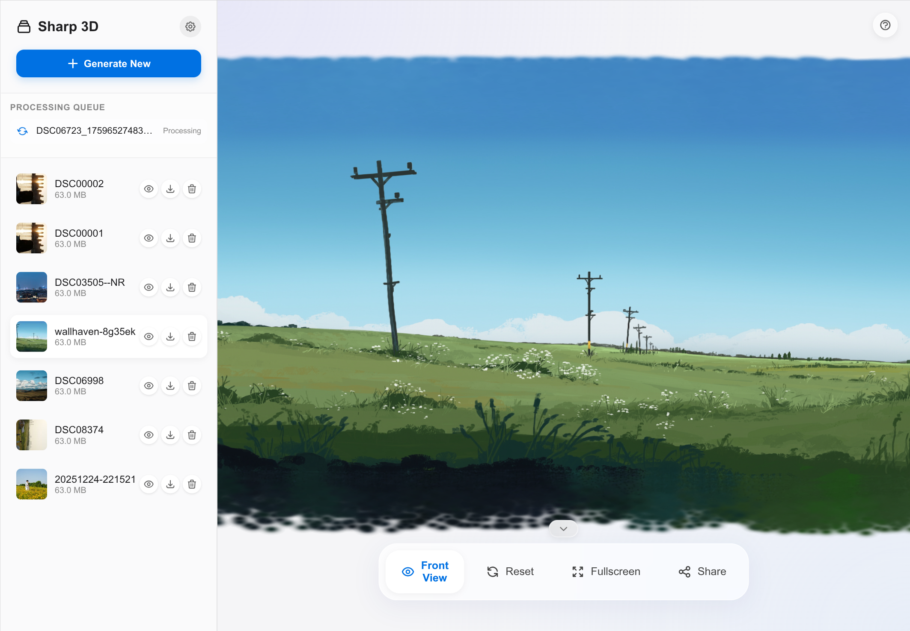
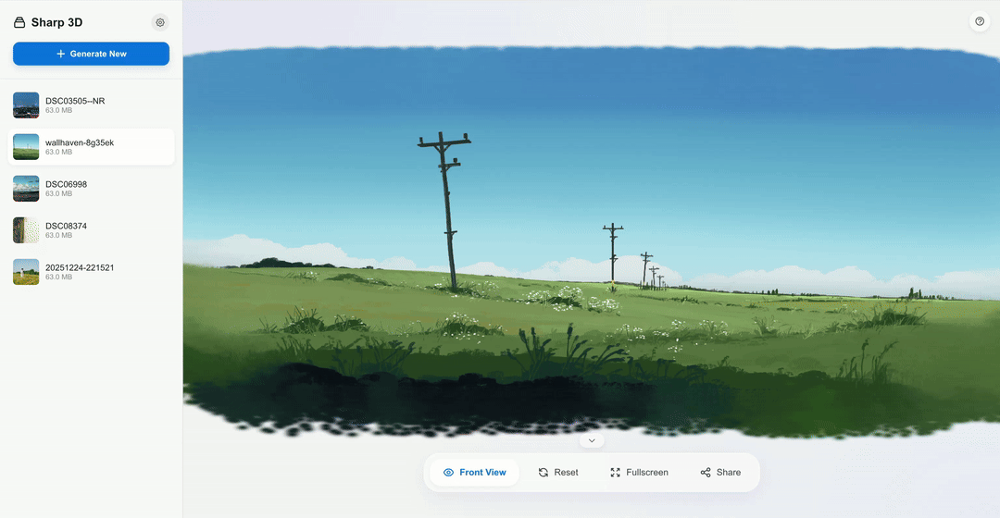

# Sharp GUI

<p align="right">
  <a href="README.md">🇨🇳 中文</a> | <a href="README.en.md">🇺🇸 English</a>
</p>

<div align="center">


**A Beautiful 3D Gaussian Splatting GUI**

Built on [Apple ml-sharp](https://github.com/apple/ml-sharp), featuring Apple-style modern design

[Features](#-features) •
[Preview](#-preview) •
[Quick Start](#-quick-start) •
[Usage](#-usage) •
[Architecture](#-architecture)

</div>

> [!WARNING]
> **No content restrictions for local deployment** - Users are responsible for generated content. Please comply with laws and regulations. See [Disclaimer](#%EF%B8%8F-disclaimer).

---

## ✨ Features

### 🎨 Apple-Style UI Design

Built with Apple Human Interface Guidelines for a premium user experience:

| Element                 | Description                                                   |
| ----------------------- | ------------------------------------------------------------- |
| **Glass Morphism**      | Global `backdrop-filter: blur()` with translucent backgrounds |
| **SF Pro Fonts**        | Apple system font stack for native rendering                  |
| **Particle Background** | Canvas-drawn floating particles for tech aesthetics           |
| **Smooth Animations**   | All interactions tuned with `cubic-bezier` easing             |
| **Dark Mode**           | Adaptive system dark mode support                             |

### 🚀 Core Features

| Feature                  | Description                                                  |
| ------------------------ | ------------------------------------------------------------ |
| **📸 Image to 3D**       | Upload any image, AI generates 3D Gaussian Splatting model   |
| **🖼️ Batch Processing**  | Multi-select/drag-drop upload with smart queue scheduling    |
| **👁️ Real-time Preview** | High-performance viewer with Three.js + Gaussian Splats 3D   |
| **📤 One-Click Share**   | Export as standalone HTML, viewable without server           |
| **📱 Mobile Optimized**  | Perfect adaptation for phones/tablets with gyroscope support |

### 🎯 UX Optimizations

- **Skeleton Loading** - Smooth gradient animation while loading thumbnails
- **Smart Polling** - 2s polling when active, 10s when idle
- **Drag & Drop** - Drop images directly into sidebar
- **Progress Bar** - Real-time loading percentage
- **Delete Animation** - Smooth slide-out effect
- **Collapsible Controls** - Bottom bar can be collapsed for more preview space

### 🔧 Advanced Features

- **🔒 HTTPS Support** - Auto-generated self-signed certificates for LAN access
- **📦 File Optimization** - PLY → Splat format conversion, **43% smaller**
- **🧹 Auto Cleanup** - Completed tasks auto-cleaned after 1 hour
- **⚙️ Configurable Paths** - Custom input/output folders
- **🖥️ Fullscreen Mode** - Immersive 3D preview

---

## 📷 Preview

### Main Interface

<p align="center">
  
</p>

<p align="center"><i>Sidebar gallery + 3D model preview + glassmorphism control bar</i></p>

### Mobile Adaptation

<p align="center">
  &nbsp;&nbsp;&nbsp;&nbsp;
  
</p>

<p align="center">
  <i>Left: Mobile drawer sidebar | Right: Tablet split layout</i>
</p>

### Feature Demos

<details>
<summary><b>🎬 Batch Upload + Queue Processing</b></summary>

<p align="center">
  
</p>

<p align="center"><i>Drag multiple images to sidebar, queue updates in real-time</i></p>

</details>

<details>
<summary><b>🎬 3D Model Interactive Preview</b></summary>

<p align="center">
  
</p>

<p align="center"><i>Mouse drag to rotate, scroll to zoom, animated reset</i></p>

</details>

<details>
<summary><b>🎬 Gyroscope Control (Mobile)</b></summary>

<p align="center">
  
</p>

<p align="center"><i>Tilt phone to control view, iOS-style real-time indicator ball</i></p>

</details>

<details>
<summary><b>🎬 One-Click Export & Share</b></summary>

<p align="center">
  
</p>

<p align="center"><i>Click Share to export standalone HTML, double-click to open in any browser</i></p>

</details>

---

## 🎨 Design Highlights

- 🪟 **Glass Morphism** - Frosted glass control bar with `backdrop-filter: blur(30px)`
- ✨ **Dynamic Particles** - Canvas-rendered floating tech-style particles
- 🎯 **iOS-Style Indicator** - Mobile gyroscope real-time feedback ball
- 🎬 **Fluid Animations** - All interactions with `cubic-bezier` easing curves
- 📱 **Responsive Design** - Perfect for desktop/tablet/mobile

---

## 🚀 Quick Start

### System Requirements

| Platform                  | Inference  | Video Rendering | Status       |
| ------------------------- | ---------- | --------------- | ------------ |
| **Linux x86_64 + NVIDIA** | ✅ CUDA    | ✅              | Full Support |
| **Linux x86_64 no GPU**   | ✅ CPU     | ❌              | Supported    |
| **macOS Apple Silicon**   | ✅ MPS     | ❌              | ✅ Verified  |
| **macOS Intel**           | ✅ CPU     | ❌              | Supported    |
| **Windows**               | ⚠️ Testing | ⚠️              | Partial      |

> ⚠️ **Note**: One-click deployment is currently verified on **macOS** only.
> For other platforms, please test and report issues on [GitHub Issues](https://github.com/lueluelue12138/sharp-gui/issues).

### One-Click Install

```bash
# Clone project
git clone https://github.com/lueluelue12138/sharp-gui.git
cd sharp-gui

# Run install script (auto-clones ml-sharp and configures environment)
./install.sh      # Linux/macOS
# or
install.bat       # Windows
```

> 💡 The install script auto-generates HTTPS certificates. HTTPS mode is recommended for full functionality.

### Start Server

```bash
./run.sh          # Linux/macOS
# or
run.bat           # Windows
```

Access **https://127.0.0.1:5050 (recommended)** or **http://127.0.0.1:5050** 🎉

---

## 📖 Usage

### Generate 3D Models

1. **Upload Image** - Click "Generate New" or drag images to sidebar
2. **Wait for Processing** - Watch queue progress (first run downloads ~500MB model)
3. **Preview Model** - Click gallery items to view 3D

### 3D Interaction Controls

| Action        | Desktop                                  | Mobile                      |
| ------------- | ---------------------------------------- | --------------------------- |
| Rotate View   | Left-click drag                          | Single finger swipe         |
| Zoom          | Scroll / Shift+Scroll (fine)             | Pinch                       |
| Gyroscope     | -                                        | Enable Gyro then tilt phone |
| Reset         | Click "Reset" button                     | Same                        |
| Toggle Limits | Click "Front View" for free/limited mode | Same                        |

### Export & Share

Click **Share** button to generate a standalone HTML file:

- 📦 Complete 3D viewer included (Three.js + Gaussian Splats 3D)
- 🌐 No server needed, double-click to open in browser
- 📉 Optimized size: PLY → Splat format, 43% smaller
- 🔒 Includes disclaimer about content responsibility

---

## ⚙️ Configuration

### Custom Folders

Edit `config.json` (generated on first run):

```json
{
  "input_folder": "/path/to/inputs",
  "output_folder": "/path/to/outputs"
}
```

### Enable HTTPS (Recommended)

HTTPS enables **gyroscope on LAN devices** (browsers require secure context for sensor APIs).

The install script auto-generates certificates. For manual generation:

```bash
python generate_cert.py
```

> 💡 **Windows Users**: Install [Git for Windows](https://git-scm.com/download/win) or OpenSSL first.

After generating, restart and access via `https://`:

| Mode      | Local                  | LAN               | Gyroscope     |
| --------- | ---------------------- | ----------------- | ------------- |
| **HTTPS** | https://127.0.0.1:5050 | https://[IP]:5050 | ✅ Available  |
| HTTP      | http://127.0.0.1:5050  | http://[IP]:5050  | ❌ Local only |

First HTTPS access shows certificate warning (self-signed), click "Continue" to proceed.

---

## 🏗️ Architecture

```
sharp-gui/
├── 📄 app.py                 # Flask backend + task queue system
├── 📄 install.sh/bat         # One-click install scripts
├── 📄 run.sh/bat             # Startup scripts
├── 📄 generate_cert.py       # SSL certificate generator (cross-platform)
├── 📁 templates/
│   ├── index.html           # Main page (2600+ lines, single-file SPA)
│   └── share_template.html  # Share page template (embedded 3D viewer)
├── 📁 static/lib/           # Three.js + Gaussian Splats 3D
├── 📁 ml-sharp/             # (after install) Apple ML-Sharp core
├── 📁 inputs/               # Input images
└── 📁 outputs/              # Output models (.ply)
```

### Tech Stack

| Layer         | Technology                                                         |
| ------------- | ------------------------------------------------------------------ |
| **Frontend**  | Native HTML/CSS/JS, Three.js, Gaussian Splats 3D, Canvas particles |
| **Styling**   | Apple Glass Morphism, SF Pro font stack, CSS variables             |
| **Backend**   | Python 3.10+, Flask, multi-threaded task queue                     |
| **AI Engine** | Apple ML-Sharp (PyTorch, gsplat)                                   |
| **3D Format** | PLY (original), Splat (optimized export)                           |

### Performance Optimizations

- **Thumbnail System** - Auto-generated 200px JPEG thumbnails to save bandwidth
- **Smart Polling** - Dynamic polling interval based on task status (2s ↔ 10s)
- **Splat Conversion** - Export converts PLY (56 bytes/point) to Splat (32 bytes/point)
- **Progress Optimization** - Progress only increases, no jumping back
- **Auto Memory Cleanup** - Completed tasks removed from memory after 1 hour

---

## 🤝 Acknowledgements

- [Apple ML-Sharp](https://github.com/apple/ml-sharp) - Core 3D generation model
- [Gaussian Splats 3D](https://github.com/mkkellogg/GaussianSplats3D) - Three.js Gaussian Splatting renderer
- [antimatter15/splat](https://github.com/antimatter15/splat) - Splat format conversion reference

---

## 🙋 Contributing

Issues and Pull Requests are welcome!

- 🐛 **Bug Reports** - Submit issues on [GitHub Issues](https://github.com/lueluelue12138/sharp-gui/issues)
- 💡 **Feature Requests** - Discuss new feature ideas via Issues
- 🔧 **Code Contributions** - Fork the project and submit PRs

If you've tested on other platforms (Linux/Windows), feedback is appreciated!

---

## ⚠️ Disclaimer

Since local deployment has **no content restrictions**, 3D models generated by this project are created by users using AI tools. **Users are solely responsible for the generated content**, which is unrelated to this open source project and its developers.

**It is strictly prohibited to use this tool to generate or distribute any illegal, infringing, or inappropriate content.**

---

## 📄 License

This project is open source under the MIT License.

Note: ML-Sharp models have a separate [Model License](https://github.com/apple/ml-sharp/blob/main/LICENSE_MODEL), for non-commercial use only.

---

<div align="center">

**If you find this useful, please give a ⭐ Star!**

Made with ❤️ by [lueluelue12138](https://github.com/lueluelue12138)

</div>
