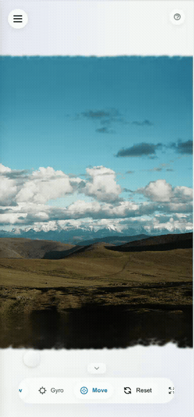

# Sharp GUI

<p align="right">
  <a href="README.md">🇨🇳 中文</a> | <a href="README.en.md">🇺🇸 English</a>
</p>
<div align="center">

**一个精美的 3D 高斯溅射 (Gaussian Splatting) 图形化界面**

<br>

**💡 项目背景**

iOS 26 的"空间照片"带来了令人惊艳的沉浸式体验，但目前仅限于苹果生态。

作为一个 Web 技术爱好者，我开发了 Sharp GUI，旨在通过浏览器打破设备界限。无论你使用 Android、Windows 还是 Mac 设备，都能 **[一键部署](#-快速开始)**，并在局域网内轻松生成并分享你的 3D 空间记忆。这是一个探索性的开源项目，希望能为你带来乐趣。

<br>


基于 [Apple ml-sharp](https://github.com/apple/ml-sharp) 打造，无需上传云端，**本地部署，全屋访问**。

[功能特性](#-功能特性) •
[界面预览](#-界面预览) •
[快速开始](#-快速开始) •
[使用指南](#-使用指南) •
[技术架构](#-技术架构)

</div>

> [!WARNING]
> **本地部署无内容限制** - 模型完全在本地生成，内容由用户自行负责，请遵守法律法规。详见 [免责声明](#%EF%B8%8F-免责声明)。
>
> **No content restrictions for local deployment** - Users are responsible for generated content. See [Disclaimer](#%EF%B8%8F-免责声明).

---

## ✨ 为什么选择 Sharp GUI?

### 🏠 一次部署，全屋访问

无需在每台设备上安装 App。只需在一台电脑上运行 Sharp GUI，局域网内的手机、平板均可通过浏览器直接访问，即刻享受 3D 视觉盛宴。HTTPS 支持确保了陀螺仪等传感器功能在任何设备上都能完美调用。

### 🚀 核心功能

| 功能                | 描述                                                                                                   |
| ------------------- | ------------------------------------------------------------------------------------------------------ |
| **📸 空间影像生成** | 上传任意图片，基于 Apple ML-Sharp 自动生成 3D 高斯溅射模型                                             |
| **🖼️ 现代工作流**   | 支持多选/拖拽批量上传，后台队列智能调度，实时进度展示                                                  |
| **👁️ 全能查看器**   | 基于 Three.js + Gaussian Splats 3D 的高性能查看器，支持**鼠标 / 触摸 / 键盘(WASD) / 陀螺仪**全模态控制 |
| **📤 零门槛分享**   | 一键导出为独立 HTML 文件，将你的空间记忆打包发给朋友，双击即看                                         |
| **🔐 安全与隐私**   | 数据完全本地化，支持一键生成 SSL 证书，保障局域网传输安全                                              |
| **📱 移动端优化**   | 完美适配手机/平板，支持陀螺仪体感控制                                                                  |
| **🚀 一键部署运行** | 自动配置 Python 环境、下载依赖、生成 HTTPS 证书，开箱即用                                              |

### 🎨 Apple 风格界面设计

采用 Apple Human Interface Guidelines 设计理念，精心打造的高级用户体验：

| 设计元素         | 描述                                                    |
| ---------------- | ------------------------------------------------------- |
| **毛玻璃效果**   | 全局 `backdrop-filter: blur()` + 半透明背景，营造层次感 |
| **SF Pro 字体**  | 使用苹果系统字体栈，原生级渲染体验                      |
| **动态粒子背景** | Canvas 绘制的浮动粒子，增添科技感                       |
| **流畅过渡动画** | 所有交互均有精心调校的 cubic-bezier 缓动曲线            |
| **深色模式**     | 自适应系统深色模式偏好                                  |

### 🎯 用户体验优化

- **骨架屏加载** - 图片缩略图加载时显示渐变骨架动画
- **智能轮询** - 有任务时 2s 轮询，空闲时降至 10s，节省资源
- **拖拽上传** - 将图片直接拖入侧边栏即可开始处理
- **拖拽预览** - 将 .ply/.splat 模型文件拖入预览区直接加载
- **队列管理** - 待处理任务支持删除/取消
- **加载进度条** - 实时显示模型加载百分比
- **删除动画** - 删除项目时平滑的滑出动画效果
- **可折叠控制栏** - 底部控制栏可收起，最大化预览空间
- **操作指南面板** - 右上角帮助按钮，清晰的交互提示

### 🎮 相机控制

| 控制方式       | 功能描述                             |
| -------------- | ------------------------------------ |
| **WASD/QE**    | 键盘平移相机（前后左右上下）         |
| **Shift+WASD** | 精细移动模式                         |
| **Shift+滚轮** | 精细缩放控制                         |
| **虚拟摇杆**   | 移动端触摸平移（点击 Move 按钮开启） |
| **陀螺仪**     | 倾斜手机预览（点击 Gyro 按钮开启）   |

<!-- TODO: 添加操作演示 GIF -->
<!--  -->

### 🔧 高级特性

- **🔒 HTTPS 支持** - 自动生成自签名证书，局域网安全访问
- **📦 文件优化** - PLY → Splat 格式转换，减少 **43%** 文件大小
- **🧹 自动清理** - 已完成任务 1 小时后自动清理，防止内存泄漏
- **⚙️ 可配置路径** - 支持自定义工作区文件夹
- **🖥️ 全屏模式** - 沉浸式 3D 预览体验
- **🌐 国际化支持** - 中英文双语界面，自动检测浏览器语言，支持手动切换

---

## 📷 界面预览

### 主界面

<p align="center">
  
</p>

<p align="center"><i>侧边栏图库列表 + 3D 模型预览区域 + 底部毛玻璃控制栏</i></p>

### 移动端适配

<p align="center">
  &nbsp;&nbsp;&nbsp;&nbsp;
  
</p>

<p align="center">
  <i>左：手机端抽屉式侧边栏 | 右：平板端分栏布局</i>
</p>

### 功能演示

<!-- <details> -->
<summary><b>🎬 相机移动控制</b></summary>

<p align="center">
  &nbsp;&nbsp;&nbsp;&nbsp;
  
</p>

<p align="center">
  <i>左：WASD/QE 键盘移动 (Shift精细) | 右：移动端虚拟摇杆</i>
</p>

<!-- </details> -->

<!-- <details> -->
<summary><b>🎬 批量上传 + 队列处理</b></summary>

<p align="center">
  
</p>

<p align="center"><i>拖拽多张图片到侧边栏，队列实时更新处理进度</i></p>

<!-- </details> -->

<!-- <details> -->
<summary><b>🎬 陀螺仪体感控制 (移动端)</b></summary>

<p align="center">
  
</p>

<p align="center"><i>倾斜手机控制视角，iOS 风格实时指示球反馈</i></p>

<!-- </details> -->

<!-- <details> -->
<summary><b>🎬 一键导出分享</b></summary>

<p align="center">
  
</p>

<p align="center"><i>点击 Share 导出独立 HTML，双击即可在任何浏览器打开</i></p>

<!-- </details> -->

---

## 🎨 设计亮点

- 🪟 **Glass Morphism** - 毛玻璃效果控制栏，`backdrop-filter: blur(30px)`
- ✨ **动态粒子背景** - Canvas 绘制的浮动科技感粒子
- 🎯 **iOS 风格指示球** - 移动端陀螺仪实时反馈
- 🎬 **流畅动画** - 所有交互均有 `cubic-bezier` 缓动曲线
- 📱 **响应式设计** - 完美适配桌面/平板/手机

---

## 🚀 快速开始

### 系统要求

| 平台                      | 推理      | 视频渲染 | 状态      |
| ------------------------- | --------- | -------- | --------- |
| **Linux x86_64 + NVIDIA** | ✅ CUDA   | ✅       | 完全支持  |
| **Linux x86_64 无 GPU**   | ✅ CPU    | ❌       | 支持      |
| **macOS Apple Silicon**   | ✅ MPS    | ❌       | ✅ 已验证 |
| **macOS Intel**           | ✅ CPU    | ❌       | 支持      |
| **Windows**               | ⚠️ 测试中 | ⚠️       | 部分支持  |

> ⚠️ **注意**: 目前一键部署流程仅在 **macOS** 上完整验证通过。  
> 其他平台（Linux/Windows）请自行测试，如遇问题欢迎在 [GitHub Issues](https://github.com/lueluelue12138/sharp-gui/issues) 反馈。

### 一键安装

```bash
# 克隆项目
git clone https://github.com/lueluelue12138/sharp-gui.git
cd sharp-gui

# 运行安装脚本 (自动拉取 ml-sharp 并配置环境)
./install.sh      # Linux/macOS
# 或
install.bat       # Windows
```

> 💡 安装脚本会自动生成 HTTPS 证书，建议使用 HTTPS 模式以获得完整功能。

### 启动服务

```bash
./run.sh          # Linux/macOS
# 或
run.bat           # Windows
```

访问 **https://127.0.0.1:5050 (推荐)** 或 **http://127.0.0.1:5050** 即可使用 🎉

---

## 📖 使用指南

### 生成 3D 模型

1. **上传图片** - 点击「Generate New」按钮或直接拖拽图片到侧边栏
2. **等待处理** - 观察队列区域的实时进度（首次运行会下载 ~500MB 模型）
3. **预览模型** - 点击图库中的项目即可查看 3D 效果

### 3D 交互控制

| 操作         | 桌面端                              | 移动端               |
| ------------ | ----------------------------------- | -------------------- |
| 旋转视角     | 鼠标左键拖拽                        | 单指滑动             |
| 缩放         | 滚轮 / Shift+滚轮(精细)             | 双指捏合             |
| 陀螺仪       | -                                   | 开启 Gyro 后倾斜手机 |
| 重置视角     | 点击「Reset」按钮                   | 相同                 |
| 切换视角限制 | 点击「Front View」切换自由/限制模式 | 相同                 |

### 导出分享

点击 **Share** 按钮，生成独立的 HTML 文件：

- 📦 包含完整的 3D 查看器（Three.js + Gaussian Splats 3D）
- 🌐 无需服务器，双击即可在浏览器打开
- 📉 已优化体积：PLY → Splat 格式转换，减少 43% 大小
- 🔒 包含免责声明，说明内容责任归属

---

## ⚙️ 配置选项

### 自定义工作目录

可通过界面设置或编辑 `config.json` (首次运行后生成):

```json
{
  "workspace_folder": "/path/to/workspace"
}
```

系统会自动在工作目录下创建：

- `inputs/` - 上传的图片
- `outputs/` - 生成的模型

### 启用 HTTPS (推荐)

启用 HTTPS 后可支持**局域网设备的陀螺仪功能**（浏览器要求安全上下文才能访问传感器 API）。

安装脚本会自动尝试生成证书。如需手动生成：

```bash
python generate_cert.py
```

> 💡 **Windows 用户**: 需要先安装 [Git for Windows](https://git-scm.com/download/win) 或 OpenSSL。

生成成功后重启服务，使用 `https://` 访问：

| 模式      | 本机                   | 局域网            | 陀螺仪    |
| --------- | ---------------------- | ----------------- | --------- |
| **HTTPS** | https://127.0.0.1:5050 | https://[IP]:5050 | ✅ 可用   |
| HTTP      | http://127.0.0.1:5050  | http://[IP]:5050  | ❌ 仅本机 |

首次访问 HTTPS 时浏览器会提示证书警告（因为是自签名证书），选择「继续访问」即可。

---

## 🏗️ 技术架构

```
sharp-gui/
├── 📄 app.py                 # Flask 后端 + 任务队列系统
├── 📄 install.sh/bat         # 一键安装脚本
├── 📄 run.sh/bat             # 启动脚本
├── 📄 generate_cert.py       # SSL 证书生成工具 (跨平台)
├── 📁 templates/
│   ├── index.html           # 主页面 (2600+ 行, 单文件 SPA)
│   └── share_template.html  # 分享页面模板 (内嵌 3D 查看器)
├── 📁 static/lib/           # Three.js + Gaussian Splats 3D
├── 📁 ml-sharp/             # (安装后) Apple ML-Sharp 核心
├── 📁 inputs/               # 输入图片存放
└── 📁 outputs/              # 输出模型 (.ply)
```

### 核心技术栈

| 层级        | 技术                                                            |
| ----------- | --------------------------------------------------------------- |
| **前端**    | 原生 HTML/CSS/JS, Three.js, Gaussian Splats 3D, Canvas 粒子动画 |
| **样式**    | Apple Glass Morphism, SF Pro 字体栈, CSS 变量系统               |
| **后端**    | Python 3.10+, Flask, 多线程任务队列                             |
| **AI 引擎** | Apple ML-Sharp (PyTorch, gsplat)                                |
| **3D 格式** | PLY (原始), Splat (优化导出)                                    |

### 性能优化

- **缩略图系统** - 自动生成 200px 宽的 JPEG 缩略图，节省带宽
- **智能轮询** - 根据任务状态动态调整轮询间隔 (2s ↔ 10s)
- **Splat 格式转换** - 导出时将 PLY (56 bytes/点) 转为 Splat (32 bytes/点)
- **进度条优化** - 只允许进度前进，避免跳变
- **自动内存清理** - 已完成任务 1 小时后自动从内存中移除

---

## 🤝 致谢

- [Apple ML-Sharp](https://github.com/apple/ml-sharp) - 核心 3D 生成模型
- [Gaussian Splats 3D](https://github.com/mkkellogg/GaussianSplats3D) - Three.js 高斯溅射渲染器
- [antimatter15/splat](https://github.com/antimatter15/splat) - Splat 格式转换参考

---

## 🙋 参与贡献

欢迎提交 Issue 和 Pull Request！

- 🐛 **Bug 反馈** - 在 [Issues](https://github.com/lueluelue12138/sharp-gui/issues) 中提交问题
- 💡 **功能建议** - 通过 Issue 讨论新功能想法
- 🔧 **代码贡献** - Fork 项目后提交 PR

如果你在其他平台（Linux/Windows）上测试通过，也欢迎反馈！

---

## ⚠️ 免责声明

由于本地部署**生成内容无限制**，本项目生成的 3D 模型由用户使用 AI 工具生成，**模型内容由用户自行负责**，与本开源项目及其开发者无关。

**严禁将本工具用于生成或传播任何违法、侵权或不当内容。**

---

## 📄 许可证

本项目基于 MIT 许可证开源。

请注意：ML-Sharp 模型有单独的 [模型许可证](https://github.com/apple/ml-sharp/blob/main/LICENSE_MODEL)，仅限非商业用途。

---

<div align="center">

**如果觉得有用，请给个 ⭐ Star 支持!**

Made with ❤️ by [lueluelue12138](https://github.com/lueluelue12138)

</div>
