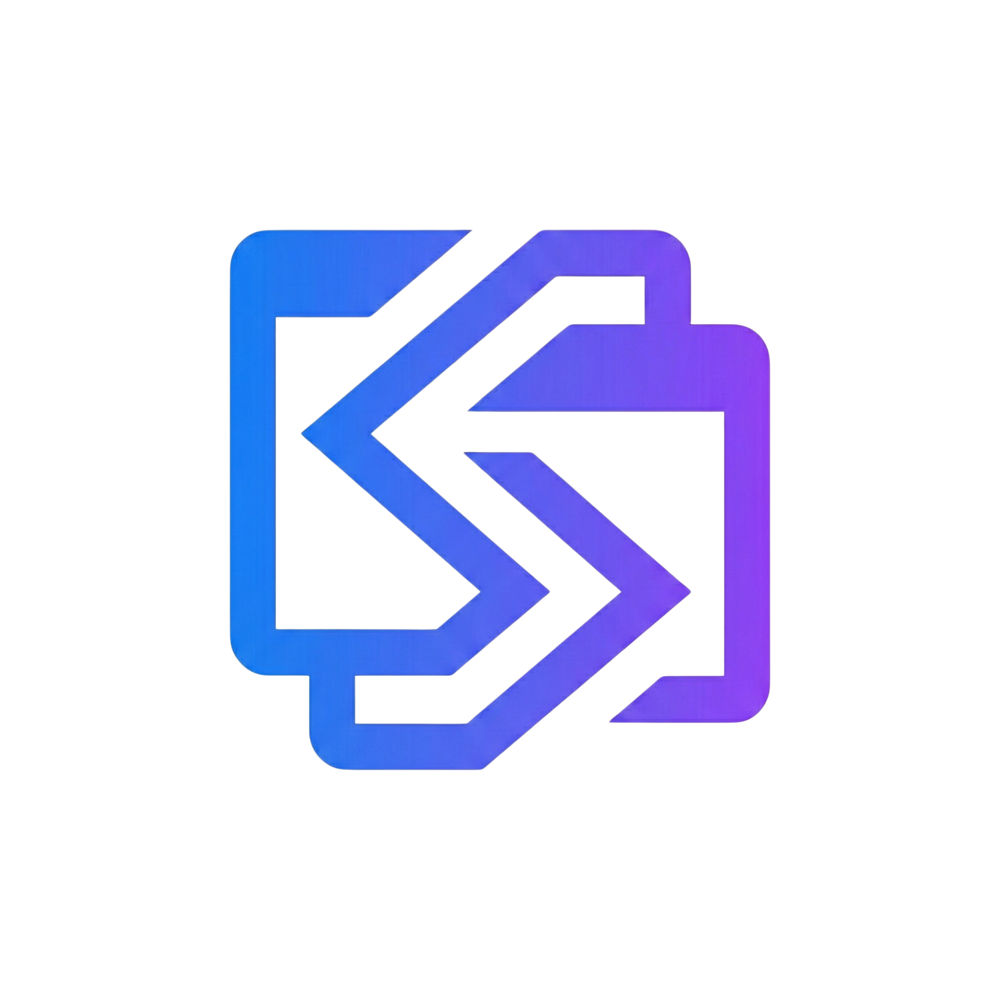
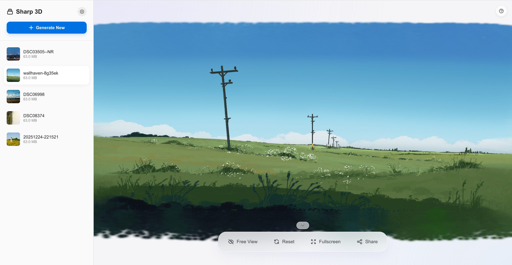
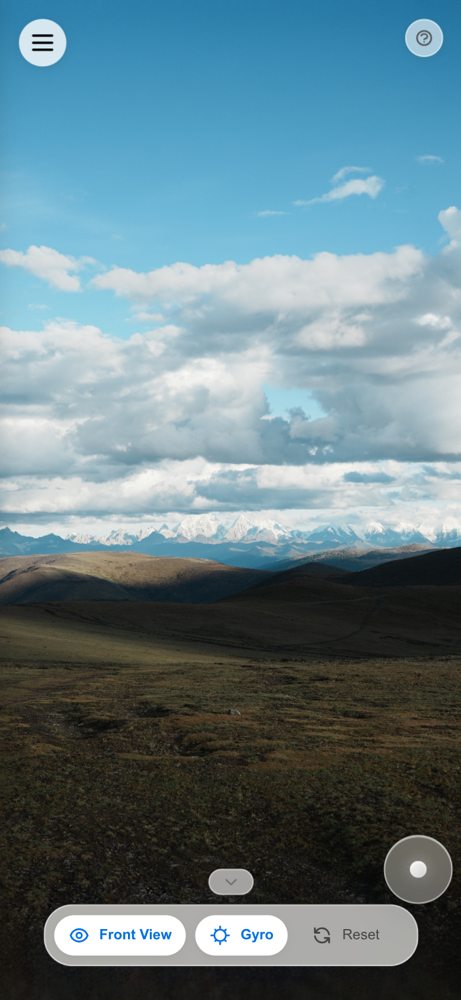
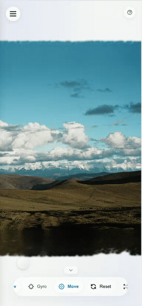
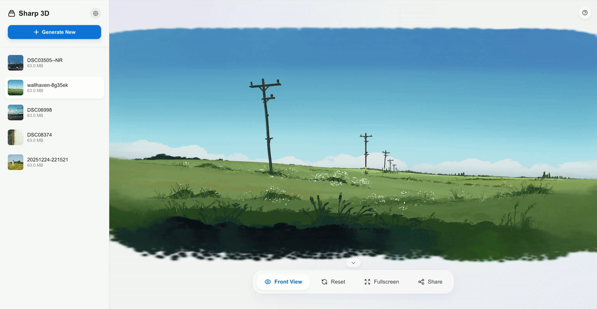

# Sharp GUI

<p align="right">
  <a href="README.md">🇨🇳 中文</a> | <a href="README.en.md">🇺🇸 English</a>
</p>
<div align="center">

**一个精美的 3D 高斯溅射 (Gaussian Splatting) 图形化界面**



<br>

**💡 项目背景**

主页：https://lueluelue12138.github.io/sharp-gui/

iOS 26 的"空间照片"带来了令人惊艳的沉浸式体验，但目前仅限于苹果生态。

作为一个 Web 技术爱好者，我开发了 Sharp GUI，旨在通过浏览器打破设备界限。无论你使用 Android、Windows、Mac 还是 VR 设备，都能 **[一键部署](#-快速开始)**，并在局域网内轻松生成并分享你的 3D 空间记忆。这是一个探索性的开源项目，希望能为你带来乐趣。

<br>


基于 [Apple ml-sharp](https://github.com/apple/ml-sharp) 打造，无需上传云端，**本地部署，全屋访问**。除了生成和查看 3D 模型，也可以把生成结果、导入模型和本机 / 移动硬盘 / NAS 媒体整理成轻量模型资产库与照片图库。

[功能特性](#-功能特性) •
[界面预览](#-界面预览) •
[快速开始](#-快速开始) •
[使用指南](#-使用指南) •
[局域网门禁](#-局域网门禁与隐私边界) •
[技术架构](#%EF%B8%8F-技术架构)

</div>

> [!WARNING]
> **本地部署无内容限制** - 模型完全在本地生成，内容由用户自行负责，请遵守法律法规。详见 [免责声明](#-免责声明)。
>
> **No content restrictions for local deployment** - Users are responsible for generated content. See [Disclaimer](#-免责声明).

---

## 📑 目录

<table align="center">
<tr>
<td width="190" align="center" valign="top">

### 🚀

**开始上手**

<sub>几分钟跑起来</sub>

<br>

[近期重点更新](#-近期重点更新)<br>
[快速开始](#-快速开始)<br>
[使用指南](#-使用指南)<br>
[版本与更新](#版本与更新)

</td>
<td width="190" align="center" valign="top">

### ✨

**功能与设计**

<sub>看看它能做什么</sub>

<br>

[功能特性](#-功能特性)<br>
[界面预览](#-界面预览)

</td>
<td width="190" align="center" valign="top">

### ⚙️

**配置与安全**

<sub>自定义与隐私边界</sub>

<br>

[配置选项](#%EF%B8%8F-配置选项)<br>
[视频重建配置](#视频重建配置)<br>
[局域网门禁](#-局域网门禁与隐私边界)

</td>
<td width="190" align="center" valign="top">

### 🛠️

**开发与社区**

<sub>动手改造、参与贡献</sub>

<br>

[技术架构](#%EF%B8%8F-技术架构)<br>
[开发者指南](#%EF%B8%8F-开发者指南)<br>
[版本历史](#-版本历史)<br>
[参与贡献](#-参与贡献) · [致谢](#-致谢)

</td>
</tr>
</table>

<div align="center"><sub>📄 <a href="#-许可证">许可证</a> &nbsp;·&nbsp; ⚠️ <a href="#-免责声明">免责声明</a></sub></div>

---

## 🆕 近期重点更新

<details open>
<summary><b>点击折叠 / Click to collapse — 用户可感知的重点能力</b></summary>

<br>

**🗂️ 本地媒体图库**：把本机、移动硬盘或 NAS 目录配置为相册，支持照片/视频混合浏览、筛选、预览、下载；照片可单张或批量转 3D，视频可直接播放、拖动进度、全屏查看。

**📦 模型资产库**：统一展示生成模型与导入的 `.ply/.spz/.splat/.rad`，支持筛选、排序、滚动增量加载、近期模型、详情面板、批量导入、下载和删除；默认打开/下载格式会跟随 Settings 中的默认模型格式并自动回退到可用文件。

**🎥 视频 3DGS 重建**：在 Windows + NVIDIA RTX 5070 Ti Laptop GPU 环境中，已验证本地视频可通过 Nerfstudio/Splatfacto 稳定路线生成 `.ply/.spz` 模型；支持质量档、focused cleanup、视频封面缩略图、原视频回看和视频模型预览坐标适配。

**📥 当前相册上传**：可直接把照片上传到当前相册目录，支持选择文件和拖拽上传，上传后自动刷新当前相册。

**⚡ 更快的图库启动**：图库索引改为按需加载，项目启动不再等待完整相册扫描，大图库首屏更快。

**🔐 局域网访问更安全**：可选访问码门禁、局域网绑定开关、敏感文件保护和默认关闭调试模式，适合在家庭局域网中长期运行。

**📦 Windows 完整便携包**：提供 `cu128-rtx50`、`cu126-mainstream` 两类核心便携 ZIP，并额外提供面向 RTX 50 视频重建的 `cu128-rtx50-video-recon` 完整包（通过 GitHub Release 网盘入口下载，附 SHA256 校验）。

完整变更见 → **[Latest Release](https://github.com/lueluelue12138/sharp-gui/releases/latest)**

</details>

---

## ✨ 功能特性

### 🏠 一次部署，全屋访问

无需在每台设备上安装 App。只需在一台电脑上运行 Sharp GUI，局域网内的手机、平板和 VR 设备均可通过浏览器直接访问，即刻享受 3D 视觉盛宴。HTTPS 支持确保了陀螺仪等传感器功能在任何设备上都能完美调用。

### 🚀 核心功能

| 功能                | 描述                                                                                                                                            |
| ------------------- | ----------------------------------------------------------------------------------------------------------------------------------------------- |
| **📸 空间影像生成** | 上传任意图片，基于 Apple ML-Sharp 自动生成 3D 高斯溅射模型，首次运行预下载 ~500MB 模型                                                          |
| **🎥 视频 3DGS 重建** | 从本地相册视频或拖入视频创建静态 Gaussian Splat 模型，走 Nerfstudio/Splatfacto 稳定路线，支持质量档、focused cleanup、任务阶段、缩略图和原视频回看 |
| **🖼️ 现代工作流**   | 多选/拖拽批量上传、虚拟滚动图库、站内原图对比、智能任务队列（活跃 2s / 空闲 10s 轮询），删除滑出动画、可取消的待处理任务                          |
| **📦 模型资产库**   | 统一浏览生成与导入模型，支持 `.ply/.spz/.splat/.rad`、筛选排序、详情元数据、近期模型、批量导入和游标式滚动加载                              |
| **🗂️ 本地媒体图库** | 配置多个本地/NAS 目录作为相册，支持照片与视频混合浏览、筛选、预览、下载；照片可一键转 3D，视频可播放并发起视频重建                          |
| **👁️ 全能查看器**   | 基于 Three.js + Spark 2.0 的 WASM 加速查看器，鼠标 / 触摸 / 键盘 (WASD) / 陀螺仪全模态控制，点击模型聚焦 + GPU 聚焦光环，快捷姿态调参             |
| **🎭 Reveal Effects** | Magic / Spread / Unroll / Twister / Rain 五种模型登场动画，可随时重放                                                                          |
| **📱 移动端优化**   | 完美适配手机/平板，陀螺仪体感控制（iOS 风格指示球反馈）、虚拟摇杆、触摸手势、抽屉式侧边栏                                                        |
| **🥽 VR/AR 预览**   | WebXR VR 模式 + AR 透视模式 (Passthrough)，Quest 3/Pro 等头显沉浸式体验，手柄摇杆 + AR 触摸手势                                                   |
| **📤 零门槛分享**   | 一键导出为 Spark 2.0 版独立 HTML 文件，默认嵌入 SPZ 紧凑模型，双击即可在任何浏览器打开                                                            |
| **🎮 GPU 加速**     | 自动检测 NVIDIA GPU，智能匹配 CUDA 版本的 PyTorch（cu118 / cu126 / cu128），显著加速推理                                                          |
| **🔄 安全自更新**   | Settings 显示正式版本与精确提交，支持 Stable / Latest 检查、兼容代码更新和一键回滚；便携包无需系统 Git                                           |
| **🔐 安全与隐私**   | 数据完全本地化、自签名 SSL 一键生成、可选局域网门禁（HttpOnly Cookie + 访问码 + 抗暴力猜测）                                                      |
| **🚀 一键部署运行** | 自动配置 Python/Git 环境、下载依赖、预下载模型、生成 HTTPS 证书、骨架屏加载进度，开箱即用                                                        |

### 🎨 Apple 风格界面设计

采用 Apple Human Interface Guidelines 设计理念：

| 设计元素             | 描述                                                                                            |
| -------------------- | ----------------------------------------------------------------------------------------------- |
| **🪟 Glass Morphism** | 全局 `backdrop-filter: blur(30px)` + 半透明面板，控制栏、Toolbar、Modal 统一玻璃质感           |
| **🔤 SF Pro 字体**    | 苹果系统字体栈，原生级渲染体验                                                                  |
| **✨ 动态粒子背景**   | Canvas 浮动粒子，默认渐显避免首屏闪现                                                           |
| **🎬 流畅过渡动画**   | `cubic-bezier` 调校的交互缓动，遵循 `prefers-reduced-motion`                                    |
| **🌗 深色模式**       | 自适应系统深色偏好                                                                              |
| **🎯 沉浸细节**       | 折叠式底部控制栏、模型加载进度条只前进、骨架屏渐变加载、删除滑出，多选浮动操作条                |

### 🔧 高级特性

- **🔒 HTTPS 支持** - 自动生成自签名证书，保障局域网传输安全（陀螺仪等传感器 API 需要安全上下文）
- **📦 文件优化** - 自动生成 SPZ 紧凑模型，通常比 PLY 小 **5-10 倍**，仍可保留 PLY 原始文件
- **🧹 自动清理** - 已完成任务 1 小时后自动从内存移除，防止内存泄漏
- **⚙️ 可配置路径** - 自定义工作区文件夹，支持 Windows / Linux / macOS
- **🖥️ 全屏模式** - 沉浸式 3D 预览
- **🥽 WebXR** - VR 预览 + AR 透视，Quest 3/Pro 等头显原生支持
- **🎯 点击聚焦** - WASM 加速射线检测 + GPU 聚焦光环动画
- **🌐 国际化** - 中英双语界面，自动检测浏览器语言，支持手动切换

---

## 📷 界面预览

### 主界面

<p align="center">
  
</p>

<p align="center"><i>模型资产库 / 近期模型 + 3D 模型预览区域 + 底部毛玻璃控制栏</i></p>

### 本地媒体图库

<p align="center">
  
</p>

<p align="center"><i>多目录相册、照片/视频混合浏览、媒体预览、多选一键转 3D</i></p>

### 视频 3DGS 重建

<p align="center">
  
</p>

<p align="center"><i>从相册视频或拖入视频进入重建弹窗，选择模式、质量、自定义参数和依赖状态</i></p>

<p align="center">
  
</p>

<p align="center"><i>选择视频 → 配置参数 → 任务队列实时进度 / 预览 → 模型图库结果与原视频回看</i></p>

### 移动端适配

<p align="center">
  &nbsp;&nbsp;&nbsp;&nbsp;
  
</p>

<p align="center">
  <i>左：手机端抽屉式侧边栏 | 右：平板端分栏布局</i>
</p>

### 🎬 相机移动控制

<p align="center">
  &nbsp;&nbsp;&nbsp;&nbsp;
  
</p>

<p align="center">
  <i>左：WASD/QE 键盘移动 (Shift 精细) | 右：移动端虚拟摇杆</i>
</p>

### 🎬 批量上传 + 队列处理

<p align="center">
  
</p>

<p align="center"><i>拖拽多张图片到侧边栏，队列实时更新处理进度</i></p>

### 🎬 陀螺仪体感控制 (移动端)

<p align="center">
  
</p>

<p align="center"><i>倾斜手机控制视角，iOS 风格实时指示球反馈</i></p>

### 🎬 一键导出分享

<p align="center">
  
</p>

<p align="center"><i>点击 Share 导出独立 HTML，双击即可在任何浏览器打开</i></p>

---

## 🚀 快速开始

### 系统要求

| 平台                        | 推理后端  | 状态      |
| --------------------------- | --------- | --------- |
| **macOS Apple Silicon**     | ✅ MPS    | ✅ 已验证 |
| **Windows x86_64**          | ✅ CPU    | ✅ 已验证 |
| **Windows x86_64 + NVIDIA** | ✅ CUDA   | ✅ 已验证 |
| **Linux x86_64**            | ✅ CPU    | ✅ 已验证 |
| **Linux x86_64 + NVIDIA**   | ✅ CUDA   | ❓ 未验证 |
| **macOS Intel**             | ✅ CPU    | ❓ 未验证 |

> 🎥 **视频推理当前验证平台**：视频 3DGS 重建目前仅在 **Windows + NVIDIA RTX 5070 Ti Laptop GPU（12GB 显存）** 上完成端到端验证。其他 Windows NVIDIA 显卡可作为兼容方向尝试，但 Linux、macOS、CPU/MPS 视频重建暂未验证。
>
> 🚀 **推荐使用 NVIDIA GPU**：3D 高斯溅射推理是计算密集型任务，CUDA 加速通常比纯 CPU 快 **数倍到十数倍**，体验差距明显。
>
> 💡 **没有 GPU 也能跑**：纯 CPU 环境下推理也能完成，只是单张图片生成耗时更长；Apple Silicon 用户可享受 MPS 后端的近 GPU 体验。
>
> 🛠️ **零手动配置**：有 NVIDIA GPU 时，安装脚本会自动检测驱动并匹配对应的 PyTorch CUDA 版本（cu118 / cu126 / cu128）。
>
> 🎥 **视频重建环境需单独确认**：常规安装和核心便携包会先保证主程序和图片 3D 推理可用；如果要从视频生成 3D 模型，请下载 `cu128-rtx50-video-recon` 包，或按 [视频重建环境手动搭建指南](#视频重建环境手动搭建指南) 安装/复用 `.video-reconstruction-env`、Nerfstudio/Splatfacto、COLMAP 和 `ffmpeg/ffprobe`。
>
> 👉 未验证平台理论上可正常工作，如遇问题欢迎在 [Issues](https://github.com/lueluelue12138/sharp-gui/issues) 反馈。

### 方式一：Windows 完整便携包 (推荐 NVIDIA 用户)

Windows RTX 50 / 主流 NVIDIA 用户可直接下载完整便携包，无需手动配置 Python、PyTorch 或模型缓存。需要视频重建时，请选择专门的视频重建完整包。

固定网盘入口：[点击打开网盘文件夹](https://pan.quark.cn/s/94f4acaada40)

网盘文件夹会持续更新到最新版本，请按显卡和用途选择：

- **RTX 50 系列（核心功能）**：下载 `cu128-rtx50` 包
- **RTX 50 系列（视频 3DGS 重建）**：下载 `cu128-rtx50-video-recon` 包
- **RTX 50 以下主流 NVIDIA（核心功能）**：下载 `cu126-mainstream` 包

下载 ZIP 和同名 `.sha256.txt` 后先校验 SHA256，解压后双击 `portable-run.bat` 启动。

> 💡 完整便携包目前面向 NVIDIA GPU，不提供纯 CPU 包；视频重建完整包当前只按 RTX 50 / CUDA 12.8 路线发布，不代表所有 NVIDIA GPU 都已完成验证。
>
> 🔄 **自更新 bootstrap 边界**：包含新更新系统的下一版完整便携包是首个 bootstrap 包。`v1.3.0` 及更早便携包没有受管 Git 工作树和内置 MinGit，必须最后下载一次新的完整包；从 bootstrap 包开始，兼容的代码 hotfix 才能直接增量更新。

### 方式二：从源码安装 (推荐 macOS / Linux / 开发者)

源码仓库已包含最新前端构建产物，普通使用不需要安装 Node.js 或手动构建前端；运行安装脚本配置 Python 环境后即可启动。

```bash
# 1. 克隆项目
git clone https://github.com/lueluelue12138/sharp-gui.git
cd sharp-gui

# 2. 运行安装脚本 (自动拉取 ml-sharp 并配置环境)
./install.sh      # Linux/macOS
# 或
install.bat       # Windows

# 3. 启动服务
./run.sh          # Linux/macOS
# 或
run.bat           # Windows
```

> 💡 只有需要修改前端源码时，才需要安装 Node.js 并运行 `./build.sh` / `build.bat` 重新生成 `frontend/dist/`。
>
> 💡 安装脚本会自动生成 HTTPS 证书，建议使用 HTTPS 模式以获得完整功能。
>
> 🎥 需要视频重建功能时，先完成常规安装，再参考 [视频重建环境手动搭建指南](#视频重建环境手动搭建指南) 准备独立依赖。

### 方式三：通用 Release 包 (免 git clone)

GitHub Release ZIP 是源码仓库的发布快照，也包含已构建好的前端。它适合不想使用 `git clone` 的用户；功能和源码安装方式基本一致，仍需要运行安装脚本配置 Python 环境、下载依赖和模型。

从 [Releases](https://github.com/lueluelue12138/sharp-gui/releases) 页面下载最新版本：

```bash
# 1. 下载并解压
unzip sharp-gui-vX.Y.Z.zip
cd sharp-gui

# 2. 运行安装脚本
./install.sh      # Linux/macOS
# 或
install.bat       # Windows

# 3. 启动服务
./run.sh          # Linux/macOS
# 或
run.bat           # Windows
```

> 💡 想尝鲜最新功能？可下载 [Pre-release](https://github.com/lueluelue12138/sharp-gui/releases) 版本（标记为 `Pre-release` 的版本）。
>
> 🎥 Release ZIP 的常规安装同样先覆盖主程序环境；视频重建依赖请参考 [视频重建环境手动搭建指南](#视频重建环境手动搭建指南) 单独确认。

### 安装脚本做了什么？

安装脚本会自动完成以下步骤，无需手动配置：

- 🐍 **检测/安装 Python** - 自动查找兼容版本 (3.10~3.13)，缺失时自动安装 (Windows)
- 📦 **检测/安装 Git** - 缺失时自动安装 (Windows)
- 🎮 **检测 NVIDIA GPU** - 有 GPU 时自动安装匹配驱动的 CUDA 版 PyTorch（cu118 / cu126 / cu128）
- 🧩 **安装依赖** - 创建虚拟环境，安装 ml-sharp 核心和 GUI 依赖
- 🎥 **视频重建环境需单独准备** - Nerfstudio/Splatfacto、COLMAP 和 `ffmpeg/ffprobe` 不作为常规安装的必需项；需要视频重建时请参考 [视频重建环境手动搭建指南](#视频重建环境手动搭建指南)
- 📥 **预下载模型** - 安装阶段即下载推理模型 (~500MB)，避免首次运行等待
- 🔐 **生成 HTTPS 证书** - 自动生成自签名证书，支持局域网安全访问

### 启动服务

```bash
./run.sh          # Linux/macOS (React 版本)
./run.sh --legacy # 使用原始单文件版本
# 或
run.bat           # Windows
```

访问 **https://127.0.0.1:5050 (推荐)** 或 **http://127.0.0.1:5050** 即可使用 🎉

> 🩺 反馈问题时可使用 verbose 模式：`./run_verbose.sh` / `run_verbose.bat`，会同步记录运行环境、命令路径、PATH 与完整异常栈到 `sharp-gui-verbose.log`。

### 版本与更新

打开 **Settings → 版本与更新** 可以查看当前正式版本基线、精确 Git 提交和所在通道。例如正式版显示 `vX.Y.Z`，位于正式版之后的 Latest 提交显示 `vX.Y.Z + N commits (abcdefg)`。本机 owner 可以检查更新、选择通道、确认安装或回滚：

- **Stable（推荐）**：最新已发布、非预发布的正式 [GitHub Release](https://github.com/lueluelue12138/sharp-gui/releases/latest)。
- **Latest**：仓库 `main` 分支当前的**精确提交**，可更早获得 hotfix，但测试程度低于 Stable。

UI 与命令行使用相同的兼容性检查和事务流程：

```bash
# Linux / macOS：只检查 Stable 或 Latest
./update.sh --channel stable --check
./update.sh --channel latest --check

# 应用对应通道的已验证目标（会要求安全前置条件全部通过）
./update.sh --channel stable
./update.sh --channel latest

# 回滚到更新前记录的上一提交
./update.sh --rollback
```

```bat
:: Windows（完整便携包优先使用包内 Python 与 MinGit）
update.bat --channel stable --check
update.bat --channel latest --check
update.bat --channel stable
update.bat --channel latest
update.bat --rollback
```

代码更新只替换受 Git 管理的 Sharp GUI 应用文件，并保留嵌入式 Python、PyTorch/CUDA、`.video-reconstruction-env/`、模型与模型缓存、所有 workspace 数据、`config.json`、证书、日志、包元数据和 `.sharp-gui-tools/`。若目标的 portable runtime revision 与当前包不一致，或兼容清单/已构建前端不满足要求，更新会在改动文件前停止并提示下载新的完整便携包。

为避免破坏正在进行的工作，存在运行/等待中的生成任务、受管源码有本地修改，或源码安装位于非 `main` 开发分支时，自动更新和回滚都会被阻止。更新在独立进程中应用精确提交并做健康检查；若 checkout 或验证失败，会自动恢复并验证上一提交后重启。Settings 中的检查、安装和回滚仅允许真实 localhost owner 操作。

### 卸载

主程序依赖安装在项目内的 `venv/` 虚拟环境中；如果启用了视频重建，独立依赖位于 `.video-reconstruction-env/`。它们都不会影响系统环境，卸载只需删除项目文件夹：

```bash
# 删除项目 (包含 venv、.video-reconstruction-env、ml-sharp、模型等)
rm -rf sharp-gui/

# (可选) 清理模型缓存
# Windows: del %USERPROFILE%\.cache\torch\hub\checkpoints\sharp_*.pt
# macOS/Linux: rm ~/.cache/torch/hub/checkpoints/sharp_*.pt
```

---

## 📖 使用指南

### 生成 3D 模型

1. **上传图片** - 点击「Generate New」按钮或直接拖拽图片到侧边栏
2. **等待处理** - 观察队列区域的实时进度（首次运行会下载 ~500MB 模型）
3. **预览模型** - 点击图库中的项目即可查看 3D 效果

### 管理模型资产库

1. **浏览资产** - 生成结果和导入模型会统一进入模型资产库；主区域按游标滚动增量加载，不再使用分页器或每页数量选择。
2. **打开与详情** - 点击模型卡片空白区域直接打开预览；桌面端 hover 后的详情按钮打开右侧详情面板，移动端点击卡片打开详情卡片。
3. **导入模型** - 可通过「导入模型」选择或拖入 `.ply/.spz/.splat/.rad`；拖入单个模型会优先临时预览，拖入多个模型会批量导入资产库。
4. **格式偏好** - Settings 中的「默认模型格式」会影响近期模型、资产库打开和下载时优先使用 SPZ 或 PLY；目标格式不存在时自动回退到资产可用文件。
5. **详情元数据** - 文件名、格式、来源、时间和大小来自索引与文件系统；PLY/SPLAT 可解析部分点数或属性，SPZ/RAD 的包围盒、坐标系、LoD 等高级信息只有在源文件或 sidecar 元数据提供时才会显示，否则保持未知，避免伪造计算结果。
6. **查看源媒体** - 详情面板顶部缩略图可打开关联的原图或视频；没有源媒体时只作为模型封面展示。

### 浏览本地媒体相册

1. **切换到图库** - 在侧栏的「模型 / 照片」入口切换到本地媒体图库
2. **添加目录** - 本机访问时添加 Windows / Linux / macOS 路径，每个目录会作为一个相册
3. **浏览媒体** - 照片使用缓存缩略图，点击加载原图；视频可直接预览、拖动进度、全屏和下载
4. **上传到相册** - 在当前相册中选择或拖拽照片上传，完成后自动刷新
5. **转换为 3D** - 照片可在卡片、预览层中单张转换，也可多选后一批加入任务队列

### 从视频生成 3D 模型

> 🎥 开始前请先确认视频重建依赖可用：安装或复用 `.video-reconstruction-env`，并确保 Nerfstudio/Splatfacto、COLMAP、`ffmpeg/ffprobe` 通过诊断。完整步骤见 [视频重建环境手动搭建指南](#视频重建环境手动搭建指南)。

1. **选择视频** - 在本地媒体图库中选择一个视频，或把单个视频拖入模型视图 / 模型列表 /「生成新模型」入口
2. **选择参数** - 弹窗中可选择模式（自动 / 物品 / 环境）、质量（快速预览 / 高质量 / 极致 / 自定义）和引擎（自动 / 稳定）；自定义可填写帧数、迭代、输入下采样、匹配方式和图像缓存
3. **等待重建** - 任务队列会显示抽帧、位姿估计、高斯优化、导出、SPZ 压缩等阶段
4. **查看结果** - 完成后模型进入现有模型图库，默认使用视频封面作为缩略图，并在 hover 操作中提供原视频回看入口

当前建议：

- **默认质量**：高质量，适合 RTX 5070 Ti Laptop 12GB 这类本机环境，约 180 帧 / 30k 迭代 / 2x 输入下采样
- **长视频建议**：选择自定义后可从 600 帧 / 35k 迭代 / 2x 输入下采样 / sequential 匹配 / CPU 图像缓存起步，优先覆盖连续走拍路径；若改用 exhaustive 完整匹配，需要显著降低帧数以避免 COLMAP 匹配压力爆炸
- **默认引擎**：自动；当前等价于已验证的稳定 Nerfstudio/Splatfacto 路线，保留后续策略切换空间
- **默认清理**：自动 / 物品模式会启用 focused cleanup，尽量移除外围游离碎片；环境模式保留完整场景
- **当前限制**：一次只提交一个视频；动态 4D、网格修补、手工裁剪、云端训练不属于当前范围

### 3D 交互控制

#### 基础操作

| 操作     | 桌面端       | 移动端   |
| -------- | ------------ | -------- |
| 旋转视角 | 鼠标左键拖拽 | 单指滑动 |
| 平移画面 | 鼠标右键拖拽 | 双指平移 |
| 缩放     | 滚轮         | 双指捏合 |
| 精细缩放 | Shift + 滚轮 | -        |
| 锁定焦点 | 点击模型     | 点击模型 |

#### 相机移动

| 控制方式         | 功能描述                             |
| ---------------- | ------------------------------------ |
| **WASD / QE**    | 键盘平移相机（前后左右上下）         |
| **Shift + WASD** | 加速移动模式                         |
| **Alt + WASD**   | 精细移动模式                         |
| **虚拟摇杆**     | 移动端触摸平移（点击 Move 按钮开启） |

#### 特殊模式

| 模式     | 操作                   | 说明                                                |
| -------- | ---------------------- | --------------------------------------------------- |
| 快捷控制 | 点击齿轮按钮           | 调整模型缩放、位置、旋转、交互方向和显示质量        |
| 渲染特效 | 点击右侧特效轨道       | 切换或重放 Magic / Spread / Unroll / Twister / Rain |
| 陀螺仪   | 点击「Gyro」按钮       | 倾斜手机控制视角                                    |
| 正面视角 | 点击「Front View」按钮 | 限制为正面视角，再次点击自由                        |
| 重置视角 | 点击「Reset」按钮      | 恢复初始视角                                        |
| 全屏模式 | 点击「Fullscreen」按钮 | 沉浸式预览                                          |
| VR 预览  | 点击「VR」按钮         | 进入 VR 模式（需 VR 设备/模拟器）                   |
| AR 透视  | 点击「AR」按钮         | 进入 AR 模式，现实世界叠加 3D 模型                  |
| 重置视角 | 按下「R」键            | 快捷键重置相机到初始位置                            |

### 导出分享

点击 **Share** 按钮，生成独立的 HTML 文件：

- 📦 包含完整的 3D 查看器（Three.js + Spark 2.0）
- 🌐 无需服务器，双击即可在浏览器打开
- 📉 默认嵌入 SPZ 紧凑模型；需要兼容旧流程时仍可导出 PLY/Splat 路径
- 🔒 包含免责声明，说明内容责任归属

---

## ⚙️ 配置选项

### 自定义工作目录

可通过界面设置或编辑 `config.json` (首次运行后生成):

```json
{
  "workspace_folder": "/path/to/workspace",
  "photo_gallery_roots_by_workspace": {
    "/path/to/workspace": [
      {
        "id": "my-album",
        "name": "Photos",
        "path": "/path/to/photos",
        "recursive": true,
        "enabled": true
      }
    ]
  }
}
```

系统会自动在工作目录下创建：

- `inputs/` - 上传图片；`inputs/.thumbnails/` 保存历史/模型缩略图缓存
- `outputs/` - 生成模型和 sidecar 元数据（`.ply` / `.spz` / `.meta.json`）
- `model-assets/` - 模型资产受控文件区：`imports/` 保存导入模型，`thumbnails/` 保存封面缓存
- `.model-asset-library/` - 模型资产索引与用户编辑信息（`index.json`）
- `.photo-gallery-cache/` - 本地媒体图库缓存：`catalog.json`、`albums/`、`thumbnails/`、`video-posters/` 和临时打包 ZIP
- `.video-reconstruction/` - 视频重建运行时数据：`jobs/` 和 `uploads/`

这些工作区运行时目录属于用户数据，默认已在 `.gitignore` 中排除，不应提交到仓库。切换 Settings 中的工作目录并自动重启后，`inputs/`、`outputs/`、`model-assets/`、`.model-asset-library/`、`.photo-gallery-cache/` 和 `.video-reconstruction/` 都会切到新工作目录；切回旧工作目录即可找回对应的模型资产、近期模型索引、相册缓存和任务相关状态。

项目根目录下的 `config.json`、`cert.pem` / `key.pem`、`sharp-gui-verbose.log` 以及 `venv/`、`.video-reconstruction-env/`、`ml-sharp/` 是部署配置、证书、日志或依赖目录，不随 workspace 切换；其中敏感文件不会通过 `/files/*` 暴露。

> 💡 相册可通过界面添加，并按工作目录分别记忆：`photo_gallery_roots_by_workspace` 以归一化后的工作目录路径为键，切换工作目录时各自展示对应相册，切回原目录即可恢复。手动编辑时请按部署端系统填写路径。Windows、Linux、macOS 均可使用，局域网设备访问时读取的是服务器所在机器的目录。
>
> ⚠️ 旧版本使用顶层 `photo_gallery_roots` 数组保存相册，升级后首次启动会自动迁移到当前工作目录对应的分桶，无需手动处理。

### 视频重建配置

Settings 中的「视频重建」区域用于查看依赖诊断和保存默认值：

- **默认质量**：快速预览 / 高质量 / 极致，对应不同帧数、训练迭代、匹配策略和输入分辨率预算；单次任务可在生成弹窗中选择自定义参数
- **默认引擎**：自动 / 稳定；自动当前使用已验证的稳定 Nerfstudio/Splatfacto 路线
- **显存预算**：自动 / 8GB / 12GB / 16GB / 24GB，用于收紧或放宽资源边界
- **保留中间文件**：用于排查抽帧、位姿和 Nerfstudio 日志，关闭时完成/取消后会清理 job 目录

Settings 中的「默认模型格式」用于控制模型资产库、近期模型、下载和打开模型时的格式优先级：

- **SPZ（紧凑）**：优先使用压缩模型，适合浏览、分享和移动端访问
- **PLY（原始）**：优先使用原始模型，适合需要保留完整原始数据的调试或后处理
- 如果资产没有首选格式，系统会自动回退到该资产可用的 `.spz/.ply/.splat/.rad`

后端进程启动后会异步预热一次视频重建依赖状态；普通打开首页或重建弹窗不会同步扫描外部工具。Settings 中点击刷新会触发后台重新检测。

### 视频重建环境手动搭建指南

以下说明面向没有下载视频重建完整包、或需要手动排障的用户和 AI Agent，覆盖从零搭建稳定视频重建路线（COLMAP + Nerfstudio/Splatfacto）的依赖。当前唯一已验证平台为 **Windows + NVIDIA GPU（RTX 5070 Ti Laptop 12GB）**。

#### 使用 AI Agent 辅助搭建

如果不想逐步手动配置，可以把当前项目交给本机 AI coding agent，让它按 README 安装并验证。推荐提示词：

> 请先了解当前 Sharp GUI 项目和视频重建流程，检查系统、GPU/驱动、Python 与 PATH；按 README 安装或复用 .video-reconstruction-env、CUDA/PyTorch、COLMAP、Nerfstudio/Splatfacto、ffmpeg/ffprobe。不要修改无关业务代码。最后运行诊断 API 和基础命令，确认依赖可用。

#### 前置条件

| 依赖 | 用途 | 获取方式 |
|------|------|----------|
| Python 3.10–3.12 | 视频重建虚拟环境基础 | [python.org](https://www.python.org/downloads/) 或系统包管理器 |
| NVIDIA GPU + 驱动 ≥ 535 | CUDA 推理与训练 | [nvidia.com/drivers](https://www.nvidia.com/Download/index.aspx) |
| Git | 克隆依赖仓库 | [git-scm.com](https://git-scm.com/) |

#### 1. 创建视频重建虚拟环境

```bash
# 在项目根目录创建独立 venv（与主项目 venv 隔离）
python -m venv .video-reconstruction-env

# 激活（Windows）
.video-reconstruction-env\Scripts\activate
# 激活（Linux/macOS）
source .video-reconstruction-env/bin/activate
```

#### 2. 安装 PyTorch (CUDA)

根据你的 GPU 和驱动选择对应 CUDA 版本。查看驱动支持的最高 CUDA：`nvidia-smi` 右上角。

```bash
# RTX 50 系列（CUDA 12.8，需驱动 ≥ 570）
pip install torch torchvision --index-url https://download.pytorch.org/whl/cu128

# RTX 20/30/40 系列主流（CUDA 12.6，需驱动 ≥ 560）
pip install torch torchvision --index-url https://download.pytorch.org/whl/cu126

# 较旧显卡（CUDA 11.8，需驱动 ≥ 520）
pip install torch torchvision --index-url https://download.pytorch.org/whl/cu118
```

#### 3. 安装稳定路线依赖（Nerfstudio / COLMAP / ffmpeg）

##### 3a. Nerfstudio + gsplat（Splatfacto 训练/导出引擎）

```bash
# gsplat（Gaussian Splatting CUDA 内核，Nerfstudio 依赖）
pip install gsplat

# Nerfstudio（提供 ns-process-data / ns-train / ns-export 命令）
pip install nerfstudio
```

> 安装后验证：`ns-train --help`、`ns-process-data --help`、`ns-export --help` 均正常输出即可。

##### 3b. COLMAP（稀疏重建/位姿估计）

- **Windows**: 下载预编译版 [COLMAP releases](https://github.com/colmap/colmap/releases)，解压后将 `bin/` 目录加入系统 `PATH`
- **Linux (Ubuntu/Debian)**: `sudo apt install colmap`
- **macOS**: `brew install colmap`

> 验证：`colmap -h` 正常输出。

##### 3c. ffmpeg + ffprobe（视频解码/抽帧）

- **Windows**: 下载 [gyan.dev builds](https://www.gyan.dev/ffmpeg/builds/) 或 [BtbN/FFmpeg-Builds](https://github.com/BtbN/FFmpeg-Builds/releases)，解压后将 `bin/` 加入 `PATH`
- **Linux**: `sudo apt install ffmpeg`
- **macOS**: `brew install ffmpeg`

> 验证：`ffmpeg -version` 和 `ffprobe -version` 正常输出。

#### 4. 验证环境完整性

启动 Sharp GUI 后打开 Settings > 视频重建，或者直接调用诊断 API：

```bash
curl http://127.0.0.1:5050/api/video-reconstructions/status | python -m json.tool
```

正确配置后各分组状态应为：

| 分组 | 状态 | 包含检测项 |
|------|------|-----------|
| **视频基础工具** (required) | ✅ Available | ffmpeg, ffprobe |
| **稳定 3DGS 路线** (stable) | ✅ Available | ns-process-data, ns-train, ns-export, colmap |

#### 依赖版本参考（已验证组合）

| 包 | 验证版本 | 备注 |
|----|---------|------|
| Python | 3.11.x | .video-reconstruction-env 使用 |
| PyTorch | 2.5+ (cu128) | RTX 5070 Ti 需 cu128；主流显卡用 cu126 |
| Nerfstudio | 1.1.x+ | 需支持 `splatfacto` 方法和 `nerfstudio-data` dataparser |
| gsplat | 1.4+ | Nerfstudio 的 Gaussian Splatting CUDA 后端 |
| COLMAP | 3.9+ | 预编译版即可，无需从源码编译 |
| ffmpeg / ffprobe | 6.x+ | 需支持 `-vf fps=` 滤镜 |

#### 目录结构总览

```
sharp-gui/
├── .video-reconstruction-env/    # 视频重建独立 venv（已被 .gitignore）
│   ├── Scripts/ 或 bin/          #   → python, ns-train, ns-export, colmap 等命令
│   └── Lib/ 或 lib/              #   → torch, nerfstudio, gsplat 等包
├── .video-reconstruction/         # 运行时中间文件（workspace 内，自动创建）
│   ├── jobs/                     #   每任务工作目录（训练/导出后清理）
│   └── uploads/                  #   拖入视频的上传缓存
└── outputs/                       # 最终产物：*.ply + *.spz + *.meta.json
```

> 💡 `.video-reconstruction-env` 已在 `.gitignore` 中排除，不会被提交到仓库。

### 启用 HTTPS (推荐)

启用 HTTPS 后可支持**局域网设备的陀螺仪功能**（浏览器要求安全上下文才能访问传感器 API）。

安装脚本会自动尝试生成证书。如需手动生成：

```bash
python tools/generate_cert.py
```

> 💡 **Windows 用户**: 需要先安装 [Git for Windows](https://git-scm.com/download/win) 或 OpenSSL。

生成成功后重启服务，使用 `https://` 访问：

| 模式      | 本机                   | 局域网            | 陀螺仪    |
| --------- | ---------------------- | ----------------- | --------- |
| **HTTPS** | https://127.0.0.1:5050 | https://[IP]:5050 | ✅ 可用   |
| HTTP      | http://127.0.0.1:5050  | http://[IP]:5050  | ❌ 仅本机 |

首次访问 HTTPS 时浏览器会提示证书警告（因为是自签名证书），选择「继续访问」即可。

---

## 🔐 局域网门禁与隐私边界

Sharp GUI 提供**可选**的局域网门禁。首次启动或本机尚未完整配置门禁时，会提示 owner 设置访问码；用户也可以稍后设置或选择不再提示。门禁默认关闭，旧 `config.json` 无需迁移。

### 权限分级一览

下表展示三类访问者在不同操作上的权限边界：

| 操作                                | 公开访问（未解锁远程） | 已解锁远程（输入访问码后） | 本机 Owner（localhost） |
| ----------------------------------- | :--------------------: | :------------------------: | :---------------------: |
| 浏览模型 / 照片 / 缩略图            |    ❌（门禁开启时）    |             ✅             |           ✅            |
| 下载原图 / 模型文件 / 导出 HTML     |    ❌（门禁开启时）    |             ✅             |           ✅            |
| 提交生成 / 照片转 3D 任务           |           ❌           |  仅在显式开启「远程生成」  |           ✅            |
| 修改设置 / 删除模型 / 重启服务      |           ❌           |             ❌             |           ✅            |
| 添加/删除相册目录 / 取消任务        |           ❌           |             ❌             |           ✅            |

### 关键行为

- **门禁开启时**，模型列表、缩略图、原图、照片相册、下载、导出和 `/files/*` 工作区资源都需要远程设备先输入访问码；解锁后浏览器会保存 HttpOnly Cookie 会话。
- **门禁关闭时**，同一局域网内能访问端口的设备可直接浏览和下载私有内容；删除、设置、重启、目录管理等 owner-only 操作仍仅限 `localhost` / `127.0.0.1`。
- **远程生成默认关闭**：远程设备即使输入了访问码，也默认只有浏览、预览、下载和导出权限。如需允许已解锁的远程设备提交生成任务，可在 Settings 的"局域网门禁"中开启"远程生成"；关闭门禁会同时收回远程生成权限。
- **抗暴力猜测**：登录失败按客户端递增延迟，并校验 Host 允许列表与真实连接地址，避免 DNS rebinding 或伪造转发头绕过 owner 判断。
- **HTTPS 与门禁分工**：HTTPS 负责传输加密和浏览器传感器能力，访问码负责访问资格；在局域网共享端口时建议两者都启用。

### 隐私与部署须知

- **敏感文件不外泄**：`/files/*` 仅服务 `outputs/` 模型、历史缩略图、`model-assets/imports/` 导入模型和 `model-assets/thumbnails/` 封面缓存；`config.json`（含会话密钥与访问码哈希）、`.model-asset-library/index.json`、`cert.pem`/`key.pem`（TLS 证书私钥）、`app.py` 源码等敏感文件**在门禁开启或关闭时都无法**通过该路由下载。
- **局域网绑定开关真实生效**：Settings 的「局域网门禁」中可切换监听绑定。开启时服务监听 `0.0.0.0`（局域网共享）；关闭后仅监听 `127.0.0.1`（仅本机，其它设备无法连接）。修改后需重启服务生效，可用环境变量 `SHARP_BIND_HOST` 覆盖。
- **调试模式默认关闭**：服务默认以非调试模式运行，异常不会向客户端返回堆栈，也不暴露交互式调试器。仅本机排障时可设 `SHARP_DEBUG=1` 临时开启，切勿在局域网/公网共享时开启。
- **反向代理注意**：若在本机前置反向代理（nginx / frp 等），所有请求的来源地址会变成 `127.0.0.1`，导致**每个访问者都被判为 owner**。如需在反代后强制访问码，请在设置中关闭「本机免登录」(`allow_localhost_bypass`，需先设置访问码)。本项目不信任 `X-Forwarded-For` 等可被伪造的转发头。
- **公网暴露提醒**：本服务面向局域网设计。如需端口转发到公网，请务必先开启门禁、设置强访问码并启用 HTTPS，自行评估风险。

---


## 🏗️ 技术架构

### 项目结构

```
sharp-gui/
├── 📄 app.py                 # Flask 兼容入口（暴露 app，python app.py 启动）
├── 📁 backend/               # 模块化 Flask 后端
│   ├── 📄 app_factory.py     # create_app()：注册 hooks/routes、挂载 TaskManager
│   ├── 📄 server.py          # 启动服务、HTTPS/LAN bind、重启支持
│   ├── 📄 runtime.py         # 环境变量、verbose 日志、Sharp 命令/设备解析
│   ├── 📄 config.py          # config.json 与 access-control normalize
│   ├── 📄 paths.py           # workspace/inputs/outputs/cache 路径上下文
│   ├── 📁 security/          # LAN 门禁、权限矩阵、request hooks
│   ├── 📁 services/          # 模型资产/照片图库、视频重建、任务队列、自更新、导出、静态文件等服务
│   └── 📁 routes/            # auth/gallery/model_assets/photo_gallery/video_reconstruction/tasks/settings/updates/files/export/frontend
├── 📄 install.sh/bat         # 一键安装脚本
├── 📄 run.sh/bat             # 启动脚本 (支持 --legacy 参数)
├── 📄 run_verbose.sh/bat     # Verbose 启动入口（生成 sharp-gui-verbose.log）
├── 📄 build.sh/bat           # 前端构建脚本
├── 📄 update.sh/bat          # 自动更新脚本
├── 📄 update-manifest.json   # 更新协议、便携运行时 revision 与目标兼容性契约
├── 📄 release.sh/bat         # 发布打包脚本
├── 📁 .sharp-gui-update/     # 本机更新状态、缓存、锁与诊断（运行时生成）
├── 📁 .sharp-gui-tools/      # 便携包自带工具（含校验过的 MinGit）
├── 📁 tools/                 # 工具脚本
│   ├── 📄 generate_cert.py   # SSL 证书生成工具
│   ├── 📄 download_model.py  # 模型下载工具
│   ├── 📄 detect_cuda.py     # CUDA 版本检测
│   ├── 📄 install_torch.py   # PyTorch + CUDA 智能安装与校验
│   └── 📄 update.py          # 自动更新核心逻辑
├── 📁 frontend/              # React 现代前端 (v1.0.0+)
├── 📁 templates/             # 原始单文件前端 (Legacy)
├── 📁 static/lib/            # Three.js + Gaussian Splats 3D（Legacy 旧前端使用）
├── 📁 ml-sharp/              # (安装后) Apple ML-Sharp 核心
├── 📁 inputs/                # 输入图片
├── 📁 outputs/               # 输出模型 (.ply + .spz)
├── 📁 model-assets/          # 导入模型与资产封面缓存（默认工作区内）
├── 📁 .model-asset-library/  # 模型资产索引和用户编辑信息（默认工作区内）
├── 📁 .video-reconstruction/ # 视频重建 job、上传视频缓存和中间文件（默认工作区内）
└── 📁 .photo-gallery-cache/  # 照片图库索引与缩略图缓存（默认工作区内）
```

### 前端架构 (React)

```
frontend/
├── 📁 src/
│   ├── 📁 api/               # API 客户端 (gallery, modelAssets, photoGallery, tasks, settings, auth)
│   ├── 📁 components/
│   │   ├── 📁 common/        # 通用组件 (Button, Modal, Loading, ImageViewer, ParticleBackground)
│   │   ├── 📁 gallery/       # 图库组件 (GalleryList, GalleryItem)
│   │   ├── 📁 modelAssets/   # 模型资产库组件 (LibraryView, Grid, Toolbar, DetailsPanel)
│   │   ├── 📁 photoGallery/  # 本地照片图库组件 (AlbumList, MasonryGrid, Toolbar)
│   │   ├── 📁 layout/        # 布局组件 (Sidebar, ControlsBar, TaskQueue, Settings, AccessGate)
│   │   └── 📁 viewer/        # 查看器组件 (ViewerCanvas, QuickControls, ViewerRevealEffectsRail, VirtualJoystick, GyroIndicator)
│   ├── 📁 hooks/             # 自定义 Hooks (useViewer, useXR, useGyroscope, useKeyboard, useGalleryVirtualizer)
│   ├── 📁 i18n/              # 国际化 (zh.json, en.json)
│   ├── 📁 store/             # Zustand 状态管理
│   ├── 📁 styles/            # 全局样式 (variables, animations)
│   ├── 📁 types/             # TypeScript 类型定义
│   └── 📁 utils/             # 工具函数
├── 📄 vite.config.ts         # Vite 配置 (代码分割)
└── 📁 dist/                  # 构建产物
```

### 核心技术栈

| 层级         | 技术                                               |
| ------------ | -------------------------------------------------- |
| **前端**     | React 19 + TypeScript + Vite / 原生单文件 (Legacy) |
| **状态管理** | Zustand                                            |
| **国际化**   | i18next + react-i18next                            |
| **样式**     | CSS Modules + Apple Glass Morphism                 |
| **后端**     | Python 3.10+, Flask app factory + Blueprints, TaskManager |
| **AI 引擎**  | Apple ML-Sharp (PyTorch, gsplat)；视频重建稳定路线使用 Nerfstudio/Splatfacto + COLMAP/ffmpeg |
| **3D 渲染**  | Three.js + Spark 2.0 (WASM 加速高斯溅射)           |

### 性能优化

| 优化项         | 说明                                                                                |
| -------------- | ----------------------------------------------------------------------------------- |
| **代码分割**   | Vite manualChunks: three.js (~493KB), spark (~487KB), react-vendor (4KB)            |
| **缩略图系统** | 模型资产库复用源媒体缩略图或缓存封面；照片图库按需生成缓存缩略图，预览/下载才读取原图 |
| **资产库浏览** | 模型资产库使用游标式滚动增量加载，网格密度只影响展示列数，不重新扫描模型目录          |
| **视频重建缓存** | 后端启动后异步检测视频重建依赖并缓存结果，Settings 可手动刷新；视频生成结果写入 sidecar 元数据并复用模型图库 |
| **智能轮询**   | 有任务时 2s 轮询，空闲时 10s，节省资源                                              |
| **格式转换**   | 生成后自动转换 SPZ 紧凑模型；分享导出默认嵌入 SPZ，历史 PLY 导出路径保留 Splat 兼容  |
| **内存清理**   | 已完成任务 1 小时后自动从内存中移除                                                 |
| **进度优化**   | 进度条只允许前进，避免视觉跳变                                                      |

---

## 🛠️ 开发者指南

### 前端开发

```bash
# 安装依赖
cd frontend
npm install

# 开发模式 (热更新)
npm run dev

# 构建生产版本
npm run build
# 或使用项目脚本
./build.sh
```

### 切换前端版本

```bash
./run.sh           # 使用 React 现代版本 (默认)
./run.sh --legacy  # 使用原始单文件版本
./run.sh --verbose # 开启详细诊断日志 (写入 sharp-gui-verbose.log)
```

### 环境变量

后端兼容入口 `app.py` 与 `backend/` 模块支持以下环境变量，普通用户无需设置，开发与排障时可按需使用：

| 变量 | 默认值 | 说明 |
|------|--------|------|
| `SHARP_FRONTEND_MODE` | `react` | 前端模式：`react`（构建版）或 `legacy`（单文件版）。`run.sh --legacy` 会设为 `legacy`。 |
| `SHARP_DEBUG` | 关闭 | 设为 `1`/`true` 开启 Flask 调试器（向浏览器返回堆栈、启用交互式调试器）。**有安全风险，仅本机排障使用，切勿在局域网/公网开启。** |
| `SHARP_VERBOSE` | 关闭 | 设为 `1`/`true` 开启详细诊断日志文件。`run.sh --verbose` / `run.bat --verbose` 会设置它。 |
| `SHARP_LOG_LEVEL` | `INFO`（verbose 时 `DEBUG`） | 应用日志级别。 |
| `SHARP_HTTP_LOGS` | 关闭 | 设为 `1`/`true` 时输出 Werkzeug HTTP 请求日志；默认关闭，避免缩略图、轮询等请求刷屏。 |
| `SHARP_LOG_FILE` | `sharp-gui-verbose.log` | 详细诊断日志的输出文件路径。 |
| `SHARP_BIND_HOST` | 跟随门禁设置 | 覆盖监听地址。不设时由「局域网门禁」中的局域网绑定开关决定（开 `0.0.0.0` / 关 `127.0.0.1`）。 |
| `SHARP_LAN_IP` | 自动探测 | 启动信息中显示的局域网 IP，`run.sh` 会自动注入。 |
| `SHARP_DEVICE` | 自动选择 | 推理设备：`cpu` / `cuda` / `mps`，留空则自动检测可用设备。 |

> `SHARP_DEBUG` 同时控制调试器、堆栈泄露与源码热重载，三者默认全部关闭。设为 `1` 后全部开启，仅供本机排障使用。（热重载与调试器绑定是因为 Werkzeug reloader 开启时会通过 socket 继承干扰 `/api/restart` 的地址重新绑定。）

### 创建发布包

```bash
# 自动构建并打包
./release.sh v1.0.0

# 输出: sharp-gui-v1.0.0.zip (包含预构建前端)
```

---

## 🤝 致谢

- [Apple ML-Sharp](https://github.com/apple/ml-sharp) - 核心 3D 生成模型
- [Spark](https://github.com/nickthetimid/spark) - WASM 加速高斯溅射渲染引擎 (Spark 2.0)
- [Gaussian Splats 3D](https://github.com/mkkellogg/GaussianSplats3D) - 原版 Three.js 高斯溅射渲染器（Legacy 版本使用）
- [antimatter15/splat](https://github.com/antimatter15/splat) - Splat 格式转换参考

---

## 🙋 参与贡献

欢迎提交 Issue 和 Pull Request！

- 🐛 **Bug 反馈** - 在 [Issues](https://github.com/lueluelue12138/sharp-gui/issues) 中提交问题
- 💡 **功能建议** - 通过 Issue 讨论新功能想法
- 🔧 **代码贡献** - Fork 项目后提交 PR
- 🖥️ **平台测试** - 如果你在 NVIDIA GPU 或其他未验证环境上测试通过，欢迎反馈！

---

## 📜 版本历史

完整版本说明、功能演进、Pre-release 通道与下载入口：

- 📦 **[GitHub Releases](https://github.com/lueluelue12138/sharp-gui/releases)** — 所有历史版本与 Release Notes
- 🆕 **[最新版本 / Latest](https://github.com/lueluelue12138/sharp-gui/releases/latest)** — 当前正式发布
- 🧪 **[Pre-release 通道](https://github.com/lueluelue12138/sharp-gui/releases?q=prerelease%3Atrue)** — 抢先体验未稳定的功能

---

## ⚠️ 免责声明

由于本地部署**生成内容无限制**，本项目生成的 3D 模型由用户使用 AI 工具生成，**模型内容由用户自行负责**，与本开源项目及其开发者无关。

**严禁将本工具用于生成或传播任何违法、侵权或不当内容。**

---

## 📄 许可证

本项目基于 MIT 许可证开源。

便携包内置 MinGit 等第三方组件时，其来源、版本和许可位置见 [THIRD_PARTY_NOTICES.md](THIRD_PARTY_NOTICES.md)。

请注意：Sharp GUI 代码的 MIT 许可证不覆盖 ML-Sharp 模型；该模型适用 Apple 单独的 [模型许可证](https://github.com/apple/ml-sharp/blob/main/LICENSE_MODEL)，仅限非商业用途。

---

<div align="center">

**如果觉得有用，请给个 ⭐ Star 支持!**

Made with ❤️ by [lueluelue12138](https://github.com/lueluelue12138)

</div>
